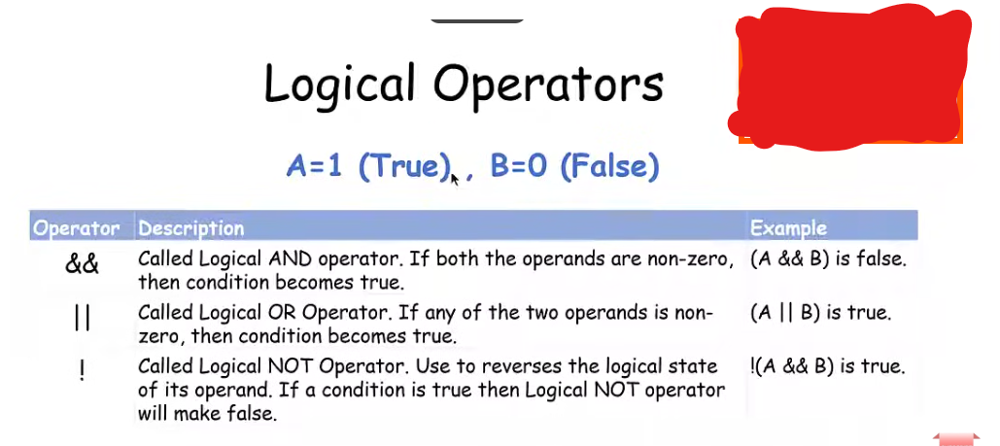

# Logical Operators

Les **Logical Operators** servent à travailler avec des valeurs **booléennes** :

```text
true  → vrai
false → faux
```

Ils permettent de **combiner** ou de **modifier des conditions**.

Il existe 3 opérateurs principaux :

```text
&&   AND
||   OR
!    NOT
```

---

## 1. `&&` — AND

`&&` signifie **ET**.

Le résultat est `true` seulement si **les deux** valeurs sont `true`.

### Exemple

```cpp
true && true
```

➡️ `true`

```cpp
true && false
```

➡️ `false`

```cpp
false && true
```

➡️ `false`

```cpp
false && false
```

➡️ `false`

### Tableau

| A     | B     | `A && B` |
| ----- | ----- | -------- |
| true  | true  | true     |
| true  | false | false    |
| false | true  | false    |
| false | false | false    |

🧠 **AND = tout doit être vrai.**

---

# 2. `||` — OR

`||` signifie **OU**.

Le résultat est `true` si **au moins une** des deux valeurs est `true`.

### Exemple

```cpp
true || true
```

➡️ `true`

```cpp
true || false
```

➡️ `true`

```cpp
false || true
```

➡️ `true`

```cpp
false || false
```

➡️ `false`

### Tableau

| A | B | `A || B` |
|---|---|---|
| true | true | true |
| true | false | true |
| false | true | true |
| false | false | false |

🧠 **OR = une seule vraie suffit.**

---

# 3. `!` — NOT

`!` signifie **NON**.

Il **inverse** la valeur.

```cpp
!true
```

➡️ `false`

```cpp
!false
```

➡️ `true`

### Tableau

| A     | `!A`  |
| ----- | ----- |
| true  | false |
| false | true  |

🧠 **NOT = inverse.**

---

# 4. Exemple simple en C++

```cpp
#include <iostream>

using namespace std;

int main() {

    bool a = true;
    bool b = false;

    cout << "a && b : " << (a && b) << endl;

    cout << "a || b : " << (a || b) << endl;

    cout << "!a : " << (!a) << endl;

    cout << "!b : " << (!b) << endl;

    return 0;
}
```

### Résultat

```text
a && b : 0
a || b : 1
!a : 0
!b : 1
```

Car :

```text
a = true
b = false
```

Donc :

```text
true && false → false → 0

true || false → true → 1

!true → false → 0

!false → true → 1
```

---

# 5. Logical Operators avec des comparaisons

Les Logical Operators sont souvent utilisés avec les **Relational Operators**.

Par exemple :

```cpp
int age = 20;
```

On peut écrire :

```cpp
age >= 18 && age <= 30
```

Cela signifie :

> age est supérieur ou égal à 18 **ET** age est inférieur ou égal à 30.

Les comparaisons donnent d'abord `true` ou `false`, puis `&&` travaille avec ces résultats.

---

# Tableau final

| Operator | Nom | Signification                    |    |                                   |
| -------- | --- | -------------------------------- | -- | --------------------------------- |
| `&&`     | AND | ET — les deux doivent être vrais |    |                                   |
| `        |     | `                                | OR | OU — au moins une doit être vraie |
| `!`      | NOT | NON — inverse le résultat        |    |                                   |

### 🧠 Astuce

```text
&& → ET → tout doit être vrai
|| → OU → une seule vraie suffit
!  → NON → inverse
```

