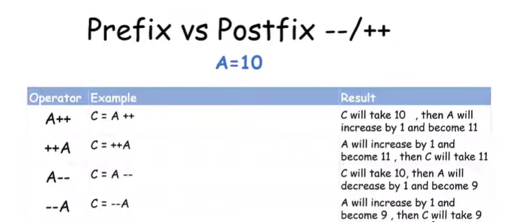

# Postfix vs Prefix : `++A` vs `A++`, `--A` vs `A--`

C'est simplement une différence **dans le moment où la valeur change**.

### 1️⃣ Prefix : `++A`

👉 **Augmente A d'abord**, puis utilise sa nouvelle valeur.

```cpp
int A = 5;

cout << ++A;
```

Résultat :

```text
6
```

Car :

```text
A = 5
↓
++A → A devient 6
↓
affiche 6
```

---

### 2️⃣ Postfix : `A++`

👉 **Utilise A d'abord**, puis augmente A.

```cpp
int A = 5;

cout << A++;
```

Résultat :

```text
5
```

Mais après l'instruction :

```text
A = 6
```

Donc :

```text
A++ → utilise 5
    → puis A devient 6
```

---

### 3️⃣ Prefix : `--A`

👉 **Diminue A d'abord**, puis utilise la nouvelle valeur.

```cpp
int A = 5;

cout << --A;
```

Résultat :

```text
4
```

---

### 4️⃣ Postfix : `A--`

👉 **Utilise A d'abord**, puis diminue A.

```cpp
int A = 5;

cout << A--;
```

Résultat :

```text
5
```

Après :

```text
A = 4
```

---

### 🧠 Résumé très simple

| Écriture | Ordre              |
| -------- | ------------------ |
| `++A`    | augmente → utilise |
| `A++`    | utilise → augmente |
| `--A`    | diminue → utilise  |
| `A--`    | utilise → diminue  |

**Astuce pour retenir :**

> **Prefix = changement avant**
> **Postfix = changement après**

