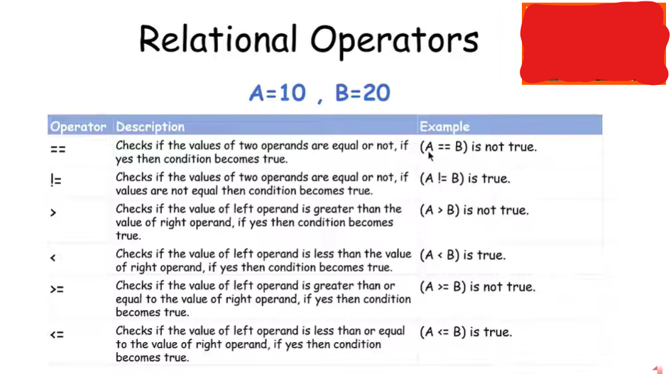

# Relational Operators

Les **Relational Operators** servent à **comparer deux valeurs**.

Le résultat d'une comparaison est toujours :

```text
true  → vrai
false → faux
```

En C++, `true` est généralement affiché comme `1` et `false` comme `0`.

---

## 1. `==` Equal to

Signifie :

> **égal à**

```cpp
10 == 10
```

Résultat :

```text
true
```

Mais :

```cpp
10 == 5
```

Résultat :

```text
false
```

⚠️ Attention :

```cpp
x = 10;
```

➡️ affectation

```cpp
x == 10;
```

➡️ comparaison

---

## 2. `!=` Not equal to

Signifie :

> **différent de**

```cpp
10 != 5
```

Résultat :

```text
true
```

Car 10 est différent de 5.

```cpp
10 != 10
```

Résultat :

```text
false
```

---

## 3. `>` Greater than

Signifie :

> **plus grand que**

```cpp
10 > 5
```

Résultat :

```text
true
```

Mais :

```cpp
5 > 10
```

Résultat :

```text
false
```

---

## 4. `<` Less than

Signifie :

> **plus petit que**

```cpp
5 < 10
```

Résultat :

```text
true
```

Mais :

```cpp
10 < 5
```

Résultat :

```text
false
```

---

## 5. `>=` Greater than or equal to

Signifie :

> **plus grand ou égal à**

```cpp
10 >= 10
```

Résultat :

```text
true
```

Car 10 est égal à 10.

```cpp
15 >= 10
```

Résultat :

```text
true
```

Mais :

```cpp
5 >= 10
```

Résultat :

```text
false
```

---

## 6. `<=` Less than or equal to

Signifie :

> **plus petit ou égal à**

```cpp
5 <= 10
```

Résultat :

```text
true
```

```cpp
10 <= 10
```

Résultat :

```text
true
```

Mais :

```cpp
15 <= 10
```

Résultat :

```text
false
```

---

# Tableau résumé

| Operator | Signification      | Exemple             |
| -------- | ------------------ | ------------------- |
| `==`     | égal à             | `10 == 10` → `true` |
| `!=`     | différent de       | `10 != 5` → `true`  |
| `>`      | plus grand que     | `10 > 5` → `true`   |
| `<`      | plus petit que     | `5 < 10` → `true`   |
| `>=`     | plus grand ou égal | `10 >= 10` → `true` |
| `<=`     | plus petit ou égal | `5 <= 10` → `true`  |

## Exemple simple en C++

```cpp
#include <iostream>

using namespace std;

int main() {

    int a = 10;
    int b = 5;

    cout << (a == b) << endl;
    cout << (a != b) << endl;
    cout << (a > b) << endl;
    cout << (a < b) << endl;
    cout << (a >= b) << endl;
    cout << (a <= b) << endl;

    return 0;
}
```

Résultat :

```text
0
1
1
0
1
0
```

### 🧠 À retenir

Les **Relational Operators** posent toujours une question :

```text
10 == 5  → Est-ce que 10 est égal à 5 ?
10 != 5  → Est-ce que 10 est différent de 5 ?
10 > 5   → Est-ce que 10 est plus grand que 5 ?
10 < 5   → Est-ce que 10 est plus petit que 5 ?
10 >= 5  → Est-ce que 10 est plus grand ou égal à 5 ?
10 <= 5  → Est-ce que 10 est plus petit ou égal à 5 ?
```

➡️ La réponse est **`true` ou `false`**.



