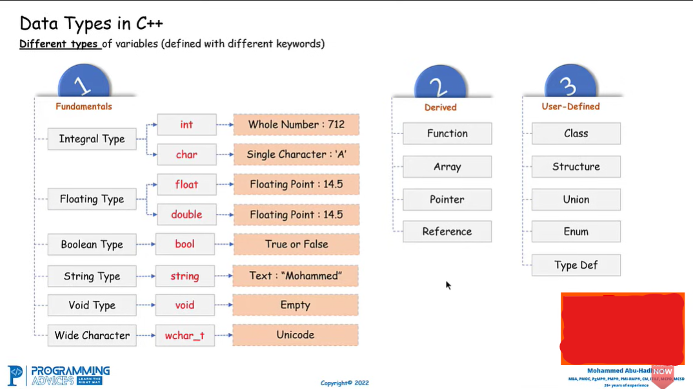

# 📦 Variables en C++ — Cours détaillé et simple

## 1️⃣ Qu'est-ce qu'une variable ?

Une **variable** est un **espace dans la mémoire de l'ordinateur** qui permet de **stocker une valeur**.

Imagine une variable comme une **boîte 📦** :

```text
        Variable
     ┌─────────────┐
     │     25      │
     └─────────────┘
          ↑
        valeur
```

La boîte possède un **nom** pour pouvoir retrouver sa valeur.

```text
Nom de la variable → age
Valeur             → 25
```

Donc :

> **Variable = nom + valeur stockée en mémoire.**

---

# 2️⃣ Pourquoi utiliser une variable ?

Un programme doit souvent **garder des informations** pour les utiliser plus tard.

Par exemple :

```text
âge       → 23
nom       → "Aya"
prix      → 25.5
étudiant  → true
```

Au lieu de répéter les valeurs partout, on leur donne un nom.

---

# 3️⃣ Une variable possède un type

Avant de créer une variable, on indique **quel type de donnée elle va contenir**.

Schéma :

```text
TYPE       NOM       VALEUR
 ↓          ↓          ↓
int        age        23
```

Le **type** indique à l'ordinateur quel genre de valeur sera stockée.

---

# 4️⃣ Les principaux types de variables

### 🔢 `int`

Pour les **nombres entiers**.

```text
age = 23
```

Exemples :

```text
0
10
25
-5
1000
```

---

### 🔢 `float`

Pour les **nombres décimaux**.

```text
price = 25.5
```

Exemples :

```text
3.14
10.5
-2.7
```

---

### 🔢 `double`

Également pour les nombres décimaux, mais avec **plus de précision** que `float`.

```text
pi = 3.1415926535
```

👉 Pour commencer :

```text
float  → décimal
double → décimal avec plus de précision
```

---

### 🔤 `char`

Pour **un seul caractère**.

```text
'A'
'B'
'7'
'?'
```

Attention :

```text
'A'    → char
"ABC"  → string
```

---

### 📝 `string`

Pour stocker du **texte**.

```text
"Hello"
"Aya"
"Bonjour tout le monde"
```

En C++, on utilise généralement `string` avec la bibliothèque appropriée.

---

### ✅ `bool`

Pour une valeur logique :

```text
true
false
```

Par exemple :

```text
student = true
```

Cela signifie :

> student est vrai.

---

# 5️⃣ Déclarer une variable

**Déclarer** une variable signifie dire à l'ordinateur :

> « Je veux créer une variable de ce type et avec ce nom. »

Schéma :

```text
TYPE + NOM
```

Par exemple :

```text
int age;
```

Cela crée :

```text
        age
         ↓
      ┌──────┐
      │      │
      └──────┘
```

La variable existe, mais elle n'a pas encore reçu la valeur que tu veux.

---

# 6️⃣ Donner une valeur à une variable

Après avoir créé la variable, on peut lui donner une valeur.

On appelle cela **l'affectation**.

Schéma :

```text
age = 23
 ↓    ↓
nom  valeur
```

La valeur `23` est placée dans la variable `age`.

```text
       age
        ↓
    ┌───────┐
    │  23   │
    └───────┘
```

---

# 7️⃣ Déclaration + initialisation

On peut aussi créer la variable **et lui donner directement une valeur**.

Schéma :

```text
TYPE + NOM + VALEUR
```

Par exemple :

```text
int age = 23;
```

Cela signifie :

```text
Créer une variable
       ↓
     appelée
       ↓
      age
       ↓
et mettre 23 dedans
```

---

# 8️⃣ Une variable peut changer

C'est une chose **très importante**.

Une variable peut recevoir une nouvelle valeur.

Au début :

```text
age = 23
```

Mémoire :

```text
age
 ↓
┌────┐
│ 23 │
└────┘
```

Puis :

```text
age = 24
```

La nouvelle valeur remplace l'ancienne :

```text
age
 ↓
┌────┐
│ 24 │
└────┘
```

👉 C'est pour cela qu'on l'appelle **variable** : sa valeur peut varier.

---

# 9️⃣ Exemple simple avec plusieurs variables

Imagine un étudiant :

```text
Nom       → "Aya"
Age       → 23
Moyenne   → 14.5
Etudiante → true
```

On peut représenter la mémoire comme ceci :

```text
┌───────────────┬─────────────────┐
│ Variable      │ Valeur          │
├───────────────┼─────────────────┤
│ nom           │ "Aya"           │
│ age           │ 23              │
│ moyenne       │ 14.5            │
│ etudiante     │ true            │
└───────────────┴─────────────────┘
```

Chaque variable possède :

**un nom + un type + une valeur.**

---

# 🔟 Modifier une variable

Supposons :

```text
score = 10
```

Puis le joueur gagne 5 points.

On peut faire :

```text
score = score + 5
```

Le calcul se fait comme ceci :

```text
ancienne valeur
      ↓
     10
      ↓
   + 5
      ↓
     15
```

La variable contient maintenant :

```text
score
  ↓
┌────┐
│ 15 │
└────┘
```

---

# 1️⃣1️⃣ Variables et calculs

Les variables peuvent être utilisées dans des calculs.

Par exemple :

```text
a = 10
b = 5
```

Puis :

```text
somme = a + b
```

Schéma :

```text
 a = 10 ──┐
          ├──→ + ──→ somme = 15
 b = 5 ───┘
```

La variable `somme` contient donc **15**.

---

# 1️⃣2️⃣ Nommer correctement une variable

Le nom doit être **clair**.

❌ Pas très clair :

```text
x
a
n
```

✅ Plus clair :

```text
age
price
studentName
totalPrice
```

Le but est de comprendre facilement ce que contient la variable.

---

# 1️⃣3️⃣ Règles importantes pour les noms

En C++, un nom de variable :

### ✅ Peut contenir :

* lettres
* chiffres
* `_`

### ❌ Ne peut pas commencer par un chiffre.

Par exemple :

```text
age1      ✅
student2  ✅
_age      ✅
```

Mais :

```text
2age      ❌
```

---

### ❌ Pas d'espace

```text
student name ❌
```

On peut utiliser :

```text
studentName ✅
```

ou :

```text
student_name ✅
```

---

### ❌ Pas utiliser les mots réservés

Certains mots appartiennent déjà au langage C++.

Par exemple :

```text
int
if
else
while
return
```

On ne doit pas les utiliser comme noms de variables.

---

# 1️⃣4️⃣ Variable vs valeur

Très important :

```text
age = 23
```

Ici :

```text
age → variable
23  → valeur
```

Schéma :

```text
      VARIABLE
         ↓
       age
         │
         ↓
    ┌─────────┐
    │   23    │ ← VALEUR
    └─────────┘
```

---

# 1️⃣5️⃣ Variable vs literal

On a vu les **literals** précédemment.

Dans :

```text
age = 23;
```

```text
age → variable
23  → integer literal
```

Donc :

> **La variable est la boîte.**

> **Le literal est la valeur écrite que l'on met dans la boîte.**

---

# 1️⃣6️⃣ Variable et mémoire 🧠

Quand tu crées une variable, l'ordinateur réserve un espace en mémoire.

Par exemple :

```text
int age = 23;
```

On peut imaginer :

```text
RAM
┌───────────────────────────┐
│                           │
│   age                     │
│   ┌─────────────┐         │
│   │     23      │         │
│   └─────────────┘         │
│                           │
└───────────────────────────┘
```

Le programme peut ensuite **lire** ou **modifier** cette valeur.

---

# 1️⃣7️⃣ Les trois opérations importantes

Avec une variable, on fait principalement :

### 📥 1. Stocker

```text
age = 23
```

```text
23 → age
```

### 📤 2. Lire

On utilise la valeur de `age`.

```text
age → 23
```

### 🔄 3. Modifier

```text
age = 24
```

```text
23 → 24
```

---

# ⭐ Résumé final

```text
                 VARIABLE
                     │
          ┌──────────┴──────────┐
          ↓                     ↓
        NOM                    TYPE
          ↓                     ↓
        age                    int
          │
          ↓
       ┌──────┐
       │  23  │
       └──────┘
          ↑
        VALEUR
```

### À retenir absolument 🧠

| Concept            | Signification                          |
| ------------------ | -------------------------------------- |
| **Variable**       | Espace nommé qui stocke une valeur     |
| **Type**           | Indique quel type de donnée est stocké |
| **Nom**            | Permet d'identifier la variable        |
| **Valeur**         | Donnée contenue dans la variable       |
| **Déclaration**    | Création de la variable                |
| **Affectation**    | Donner/modifier une valeur             |
| **Initialisation** | Donner une première valeur             |

👉 **Phrase simple à mémoriser :**

> **Une variable est une zone de mémoire identifiée par un nom, qui contient une valeur et dont la valeur peut changer pendant l'exécution du programme.**


