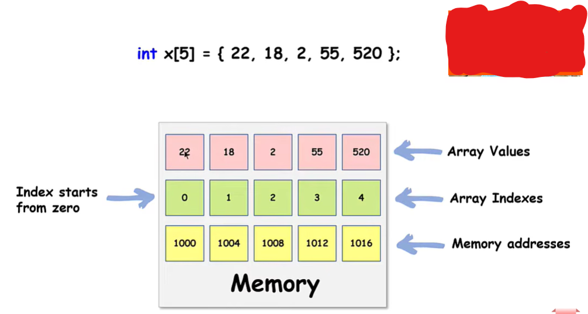

# 📦 Arrays (Tableaux) en C++

## 1. Qu'est-ce qu'un Array ?

Un **Array** (tableau) est une variable qui permet de stocker **plusieurs valeurs du même type**.

Au lieu de faire :

```cpp
int age1 = 18;
int age2 = 20;
int age3 = 22;
int age4 = 19;
```

On peut faire :

```cpp
int ages[4] = {18, 20, 22, 19};
```

👉 `ages` contient maintenant **4 valeurs**.

---

## 2. Structure d'un Array

```cpp
int ages[4] = {18, 20, 22, 19};
```

| Élément            | Signification     |
| ------------------ | ----------------- |
| `int`              | type des éléments |
| `ages`             | nom du tableau    |
| `[4]`              | nombre d'éléments |
| `{18, 20, 22, 19}` | valeurs           |

⚠️ Toutes les valeurs doivent être du **même type**.

Par exemple :

```cpp
int numbers[3] = {10, 20, 30};
```

Mais pas :

```cpp
int numbers[3] = {10, "Aya", 30}; // ❌
```

---

# 3. Index

Un tableau commence toujours par **l'index 0**.

Exemple :

```cpp
int numbers[4] = {10, 20, 30, 40};
```

| Index | Valeur |
| ----: | -----: |
|   `0` |     10 |
|   `1` |     20 |
|   `2` |     30 |
|   `3` |     40 |

Donc :

```cpp
numbers[0]  // 10
numbers[1]  // 20
numbers[2]  // 30
numbers[3]  // 40
```

⚠️ Pour un tableau de **4 éléments**, le dernier index est **3**, pas 4.

### Règle importante :

**Dernier index = taille - 1**

---

# 4. Modifier une valeur

On peut modifier une valeur directement avec son index.

```cpp
int numbers[3] = {10, 20, 30};

numbers[1] = 50;
```

Le tableau devient :

```text
10   50   30
```

Parce que `numbers[1]` était `20`.

---

# 5. Lire une valeur

Pour afficher une valeur :

```cpp
cout << numbers[0];
```

Cela affiche le premier élément.

On peut aussi afficher :

```cpp
cout << numbers[2];
```

Cela affiche le troisième élément.

---

# 6. Déclarer un Array sans valeurs

On peut créer un tableau sans lui donner immédiatement des valeurs :

```cpp
int numbers[5];
```

Cela crée un tableau capable de contenir **5 int**.

Ensuite :

```cpp
numbers[0] = 10;
numbers[1] = 20;
numbers[2] = 30;
numbers[3] = 40;
numbers[4] = 50;
```

---

# 7. Array + boucle `for`

C'est l'utilisation la plus importante des tableaux.

Au lieu d'écrire :

```cpp
cout << numbers[0] << endl;
cout << numbers[1] << endl;
cout << numbers[2] << endl;
cout << numbers[3] << endl;
cout << numbers[4] << endl;
```

On peut utiliser une boucle :

```cpp
int numbers[5] = {10, 20, 30, 40, 50};

for (int i = 0; i < 5; i++)
{
    cout << numbers[i] << endl;
}
```

### Comment ça fonctionne ?

`i` représente l'index.

```text
i = 0 → numbers[0]
i = 1 → numbers[1]
i = 2 → numbers[2]
i = 3 → numbers[3]
i = 4 → numbers[4]
```

Donc la boucle parcourt tout le tableau.

---

# 8. Pourquoi utiliser `i < 5` ?

Pour :

```cpp
int numbers[5];
```

les index sont :

```text
0  1  2  3  4
```

Donc :

```cpp
i < 5
```

permet d'aller de `0` jusqu'à `4`.

⚠️ On ne fait pas :

```cpp
i <= 5
```

car cela essayerait d'accéder à :

```cpp
numbers[5]
```

qui n'existe pas.

---

# 9. Array de `string`

Un Array ne contient pas seulement des nombres.

On peut avoir :

```cpp
string names[3] = {"Aya", "Sara", "Salma"};
```

Les index :

```text
names[0] → Aya
names[1] → Sara
names[2] → Salma
```

Et :

```cpp
for (int i = 0; i < 3; i++)
{
    cout << names[i] << endl;
}
```

---

# 10. Array de `double`

```cpp
double prices[4] = {12.5, 20.5, 8.99, 15.0};
```

Tous les éléments sont des `double`.

---

# 11. Trouver la somme des éléments

Exemple :

```cpp
int numbers[4] = {10, 20, 30, 40};

int sum = 0;

for (int i = 0; i < 4; i++)
{
    sum = sum + numbers[i];
}
```

Résultat :

```text
sum = 100
```

### Logique :

```text
sum = 0

i = 0 → sum = 0 + 10 = 10
i = 1 → sum = 10 + 20 = 30
i = 2 → sum = 30 + 30 = 60
i = 3 → sum = 60 + 40 = 100
```

---

# 12. Trouver la moyenne

```cpp
int numbers[4] = {10, 20, 30, 40};

int sum = 0;

for (int i = 0; i < 4; i++)
{
    sum = sum + numbers[i];
}

double average = (double)sum / 4;
```

La somme est `100`.

Donc :

```text
100 / 4 = 25
```

La moyenne est **25**.

---

# 13. Trouver le plus grand élément

On peut utiliser une variable `max`.

```cpp
int numbers[5] = {10, 50, 20, 80, 30};

int max = numbers[0];

for (int i = 1; i < 5; i++)
{
    if (numbers[i] > max)
    {
        max = numbers[i];
    }
}
```

Résultat :

```text
max = 80
```

### Pourquoi commencer par `numbers[0]` ?

Parce qu'on prend d'abord le premier élément comme référence :

```text
max = 10
```

Puis on compare avec les autres.

---

# 14. Trouver le plus petit élément

Même logique :

```cpp
int numbers[5] = {10, 50, 20, 80, 30};

int min = numbers[0];

for (int i = 1; i < 5; i++)
{
    if (numbers[i] < min)
    {
        min = numbers[i];
    }
}
```

Résultat :

```text
min = 10
```

---

# 15. Rechercher une valeur

Supposons :

```cpp
int numbers[5] = {10, 20, 30, 40, 50};
```

On veut savoir si `30` existe.

On parcourt le tableau :

```cpp
for (int i = 0; i < 5; i++)
{
    if (numbers[i] == 30)
    {
        cout << "Found";
    }
}
```

Ici :

```text
numbers[0] → 10
numbers[1] → 20
numbers[2] → 30 ← trouvé
```

---

# 16. Array et `sizeof`

On peut connaître la taille totale occupée en mémoire :

```cpp
int numbers[5];

sizeof(numbers);
```

⚠️ Cela donne la taille en **bytes**, pas le nombre d'éléments.

Pour connaître le nombre d'éléments :

```cpp
sizeof(numbers) / sizeof(numbers[0])
```

Exemple :

```text
sizeof(numbers) = 20 bytes
sizeof(numbers[0]) = 4 bytes

20 / 4 = 5 éléments
```

C'est une technique très utile avec les tableaux C++ classiques.

---

# 17. Array de `char`

Un tableau peut également contenir des caractères :

```cpp
char letters[4] = {'A', 'B', 'C', 'D'};
```

Index :

```text
letters[0] → A
letters[1] → B
letters[2] → C
letters[3] → D
```

---

# 18. Array à deux dimensions

Un tableau peut avoir plusieurs dimensions.

Exemple :

```cpp
int numbers[2][3];
```

Cela signifie :

```text
2 lignes
3 colonnes
```

On peut le représenter comme une matrice :

```text
       0   1   2
     ┌───┬───┬───┐
  0  │10 │20 │30 │
     ├───┼───┼───┤
  1  │40 │50 │60 │
     └───┴───┴───┘
```

Accès :

```cpp
numbers[0][0]  // 10
numbers[0][1]  // 20
numbers[1][0]  // 40
```

Pour parcourir les deux dimensions, on utilise généralement **deux boucles `for`**.

---

# 🧠 À retenir

### Array = plusieurs valeurs du même type

```cpp
int numbers[5] = {10, 20, 30, 40, 50};
```

### Index commence à 0

```text
0 → premier
1 → deuxième
2 → troisième
...
```

### Dernier index

```text
taille - 1
```

### Accéder à un élément

```cpp
numbers[2]
```

### Modifier

```cpp
numbers[2] = 100;
```

### Parcourir

```cpp
for (int i = 0; i < 5; i++)
{
    cout << numbers[i];
}
```

### Somme

```text
sum = sum + numbers[i]
```

### Maximum

```text
max = numbers[0]
```

### Minimum

```text
min = numbers[0]
```

### Recherche

```text
numbers[i] == valeur
```

---

## ⭐ La logique principale à retenir

Quand tu travailles avec un Array, pense toujours :

**1. Quelle est la taille ?**
**2. Quel est le premier index ? → 0**
**3. Quel est le dernier index ? → taille - 1**
**4. Est-ce que je dois parcourir le tableau ? → `for`**
**5. Est-ce que je cherche, additionne, compare ou modifie les valeurs ?**



