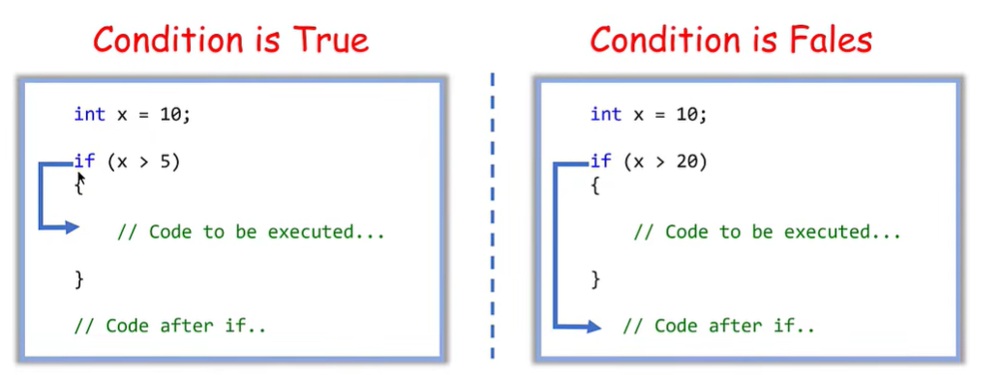
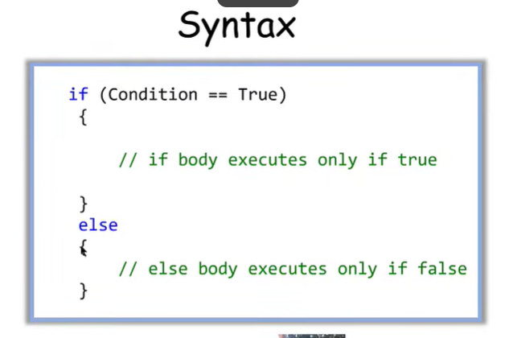

# 🔀 Conditional Statements: `if`, `if...else`

## 1. Qu'est-ce qu'une condition ?

Une **condition** permet au programme de **prendre une décision**.

Le programme vérifie une question :

> **Est-ce que cette condition est vraie ou fausse ?**

Exemple dans la vie :

```text
Si il pleut
    → prendre un parapluie
```

En programmation :

```text
Si age >= 18
    → afficher "Adult"
```

---

# 2. `if`

`if` signifie **"si"**.

Syntaxe :

```cpp
if (condition)
{
    // code exécuté si la condition est vraie
}
```

Exemple :

```cpp
int age = 20;

if (age >= 18)
{
    cout << "Adult";
}
```

### Que se passe-t-il ?

```text
age = 20

20 >= 18 → TRUE ✅

Donc :
"Adult"
```

---

# 3. Si la condition est fausse

```cpp
int age = 15;

if (age >= 18)
{
    cout << "Adult";
}
```

La condition :

```text
15 >= 18 → FALSE ❌
```

Donc le programme **n'exécute pas** le code à l'intérieur du `if`.

---

# 4. `if...else`

`else` signifie **"sinon"**.

Il permet de faire quelque chose lorsque la condition est **fausse**.

Syntaxe :

```cpp
if (condition)
{
    // si TRUE
}
else
{
    // si FALSE
}
```

Exemple :

```cpp
int age = 15;

if (age >= 18)
{
    cout << "Adult";
}
else
{
    cout << "Minor";
}
```

Résultat :

```text
Minor
```

Parce que :

```text
15 >= 18 → FALSE

Donc → else
```

---

# 5. La logique de `if...else`

Retenir simplement :

```text
             Condition
                 ↓
            ┌────┴────┐
          TRUE       FALSE
           ↓            ↓
          IF          ELSE
```

Exemple :

```text
Age >= 18 ?
    ↓
   Oui → Adult
   Non → Minor
```

---

# 6. Les opérateurs de comparaison

Les conditions utilisent souvent les **relational operators** :

| Opérateur | Signification     |
| --------- | ----------------- |
| `==`      | égal à            |
| `!=`      | différent de      |
| `>`       | supérieur à       |
| `<`       | inférieur à       |
| `>=`      | supérieur ou égal |
| `<=`      | inférieur ou égal |

### Exemple

```cpp
int age = 20;

if (age == 20)
{
    cout << "Age is 20";
}
```

Ici :

```text
20 == 20 → TRUE
```

---

# 7. Attention : `=` et `==`

C'est une erreur très importante pour les débutants.

### `=`

C'est **l'affectation** :

```cpp
age = 20;
```

Cela signifie :

> Mettre `20` dans `age`.

### `==`

C'est **la comparaison** :

```cpp
age == 20
```

Cela signifie :

> Est-ce que `age` est égal à `20` ?

🧠 Retenir :

```text
=   → donner une valeur
==  → comparer
```

---

# 8. Exemple avec une note

```cpp
double grade = 15;

if (grade >= 10)
{
    cout << "Passed";
}
else
{
    cout << "Failed";
}
```

Logique :

```text
15 >= 10 → TRUE
        ↓
     Passed
```

Si :

```cpp
double grade = 8;
```

Alors :

```text
8 >= 10 → FALSE
       ↓
    Failed
```

---

# 9. Exemple avec un nombre

```cpp
int number = 10;

if (number > 0)
{
    cout << "Positive";
}
else
{
    cout << "Negative or zero";
}
```

Ici :

```text
10 > 0 → TRUE
       ↓
   Positive
```

---

# 10. Condition avec `string`

On peut aussi comparer des chaînes.

```cpp
string password = "1234";

if (password == "1234")
{
    cout << "Correct";
}
else
{
    cout << "Incorrect";
}
```

La condition vérifie :

```text
password == "1234" ?
```

---

# 11. Condition avec `bool`

Un `bool` contient :

```text
true
false
```

Exemple :

```cpp
bool isStudent = true;

if (isStudent)
{
    cout << "You are a student";
}
```

Ici, `isStudent` vaut `true`, donc le code du `if` est exécuté.

---

# 12. Plusieurs instructions dans `if`

On peut mettre plusieurs instructions dans les `{}` :

```cpp
int age = 20;

if (age >= 18)
{
    cout << "Adult" << endl;
    cout << "You can vote" << endl;
}
```

Les deux instructions sont exécutées si la condition est vraie.

---

# 13. `if` sans `else`

On n'est pas obligé d'utiliser `else`.

```cpp
int age = 20;

if (age >= 18)
{
    cout << "Adult";
}
```

Si la condition est fausse, simplement **rien ne se passe**.

---

# 14. `if` avec plusieurs conditions

On peut utiliser les **logical operators**.

### `&&` → AND

Les deux conditions doivent être vraies.

```cpp
int age = 20;
double grade = 15;

if (age >= 18 && grade >= 10)
{
    cout << "Accepted";
}
```

Il faut :

```text
age >= 18   → TRUE
grade >= 10 → TRUE

TRUE && TRUE → TRUE
```

---

### `||` → OR

Une seule condition vraie suffit.

```cpp
int age = 17;

if (age >= 18 || age == 17)
{
    cout << "Allowed";
}
```

---

### `!` → NOT

Inverse une condition.

```cpp
bool isStudent = false;

if (!isStudent)
{
    cout << "Not a student";
}
```

---

# 15. Exemple avec `cin`

Les conditions sont très souvent utilisées avec les entrées utilisateur.

```cpp
int age;

cout << "Enter your age: ";
cin >> age;

if (age >= 18)
{
    cout << "Adult";
}
else
{
    cout << "Minor";
}
```

Le programme :

```text
1. demande l'âge
2. reçoit l'âge
3. vérifie la condition
4. choisit IF ou ELSE
```

---

# ⭐ Résumé

### `if`

> Exécuter quelque chose **si la condition est vraie**.

```cpp
if (condition)
{
    // code
}
```

### `if...else`

> Faire une chose si TRUE, une autre si FALSE.

```cpp
if (condition)
{
    // TRUE
}
else
{
    // FALSE
}
```

### Comparaison

```text
==   égal
!=   différent
>    supérieur
<    inférieur
>=   supérieur ou égal
<=   inférieur ou égal
```

### Logique

```text
&&   AND → toutes les conditions doivent être vraies
||   OR  → au moins une condition vraie
!    NOT → inverse
```

---

## 🧠 La logique principale à retenir

Quand tu rencontres un `if`, pose-toi toujours :

**1. Quelle est la condition ?**

**2. Est-elle TRUE ou FALSE ?**

**3. Si TRUE → qu'est-ce qui s'exécute ?**

**4. Si FALSE → y a-t-il un `else` ?**

Exemple :

```cpp
if (grade >= 10)
{
    cout << "Passed";
}
else
{
    cout << "Failed";
}
```

Réflexion :

```text
grade = 15

15 >= 10 ?
    ↓
  TRUE
    ↓
"Passed"
```

👉 **`if` = prendre une décision selon une condition.**



