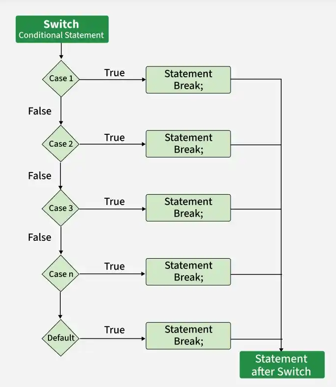

# 🔀 C++ — Switch ... Case Statement

## 1. Qu'est-ce que `switch` ?

`switch` est une structure **conditional statement** qui permet de choisir **une action parmi plusieurs possibilités**.

Il est particulièrement utile lorsque nous voulons comparer **une même variable** avec plusieurs valeurs précises.

### Exemple de situation

On demande un numéro de jour :

* `1` → Monday
* `2` → Tuesday
* `3` → Wednesday
* etc.

Au lieu d'écrire beaucoup de `if ... else if`, on peut utiliser `switch`.

---

# 2. Syntaxe

```cpp
switch (variable)
{
    case valeur1:
        // instruction
        break;

    case valeur2:
        // instruction
        break;

    case valeur3:
        // instruction
        break;

    default:
        // si aucune valeur ne correspond
}
```

### Les éléments importants

| Élément    | Rôle                                  |
| ---------- | ------------------------------------- |
| `switch`   | commence la sélection                 |
| `variable` | valeur que l'on veut tester           |
| `case`     | représente une possibilité            |
| `break`    | arrête le `switch`                    |
| `default`  | exécuté si aucun `case` ne correspond |

---

# 3. Exemple simple

```cpp
int day = 2;

switch (day)
{
    case 1:
        cout << "Monday";
        break;

    case 2:
        cout << "Tuesday";
        break;

    case 3:
        cout << "Wednesday";
        break;

    default:
        cout << "Invalid day";
}
```

### Que se passe-t-il ?

La variable contient :

```cpp
day = 2;
```

`switch` cherche le `case` qui correspond :

```cpp
case 2:
```

Donc :

```text
Tuesday
```

est affiché.

---

# 4. Pourquoi utiliser `break` ?

`break` signifie :

> **"J'ai trouvé mon case, arrête le switch."**

Exemple :

```cpp
int number = 2;

switch (number)
{
    case 1:
        cout << "One";
        break;

    case 2:
        cout << "Two";
        break;

    case 3:
        cout << "Three";
        break;
}
```

Quand `number` vaut `2` :

```text
case 1 ❌
case 2 ✅ → Two
break → STOP
```

Donc le programme ne continue pas vers `case 3`.

---

# 5. Que se passe-t-il si on oublie `break` ?

C'est très important.

```cpp
int number = 2;

switch (number)
{
    case 1:
        cout << "One";

    case 2:
        cout << "Two";

    case 3:
        cout << "Three";
}
```

Si `number = 2`, le programme peut afficher :

```text
TwoThree
```

Pourquoi ?

Parce qu'après avoir trouvé `case 2`, il continue dans les cases suivantes puisqu'il n'y a pas de `break`.

Donc, dans un `switch` classique :

```cpp
case ...
    instruction;
    break;
```

---

# 6. Le rôle de `default`

`default` est comme le **`else`** d'un `if`.

Exemple :

```cpp
int number = 7;

switch (number)
{
    case 1:
        cout << "One";
        break;

    case 2:
        cout << "Two";
        break;

    case 3:
        cout << "Three";
        break;

    default:
        cout << "Unknown number";
}
```

Ici `7` ne correspond à aucun `case`.

Donc :

```text
Unknown number
```

### Comparaison

```cpp
if (number == 1)
```

correspond à :

```cpp
case 1:
```

et :

```cpp
else
```

correspond à :

```cpp
default:
```

---

# 7. Plusieurs `case` peuvent avoir la même action

On peut regrouper plusieurs valeurs.

```cpp
int day = 6;

switch (day)
{
    case 6:
    case 7:
        cout << "Weekend";
        break;

    default:
        cout << "Weekday";
}
```

Si :

```cpp
day = 6
```

ou :

```cpp
day = 7
```

le résultat sera :

```text
Weekend
```

Ici, le premier `case` n'a pas d'instruction ni de `break`.

Il tombe volontairement sur le même bloc.

---

# 8. `switch` avec `char`

`switch` ne fonctionne pas seulement avec des nombres.

On peut utiliser un `char`.

```cpp
char grade = 'A';

switch (grade)
{
    case 'A':
        cout << "Excellent";
        break;

    case 'B':
        cout << "Good";
        break;

    case 'C':
        cout << "Average";
        break;

    default:
        cout << "Unknown grade";
}
```

Ici :

```cpp
grade = 'A'
```

donne :

```text
Excellent
```

---

# 9. `switch` avec `enum`

C'est particulièrement intéressant avec les `enum`.

Par exemple :

```cpp
enum class Color
{
    Red,
    Green,
    Blue
};
```

On peut faire :

```cpp
Color color = Color::Red;

switch (color)
{
    case Color::Red:
        cout << "Red";
        break;

    case Color::Green:
        cout << "Green";
        break;

    case Color::Blue:
        cout << "Blue";
        break;
}
```

### Pourquoi c'est intéressant ?

Compare :

```cpp
case 0:
```

avec :

```cpp
case Color::Red:
```

La deuxième version est beaucoup plus claire.

En lisant :

```cpp
Color::Red
```

on comprend immédiatement ce que représente la valeur.

C'est l'un des grands avantages des `enum`.

---

# 10. `switch` VS `if ... else if`

Les deux permettent de faire des choix, mais ils ne sont pas utilisés exactement dans les mêmes situations.

### `switch`

Très pratique lorsque l'on compare **une variable avec plusieurs valeurs précises** :

```cpp
switch (day)
{
    case 1:
    case 2:
    case 3:
}
```

### `if ... else if`

Plus adapté pour les **conditions et les intervalles** :

```cpp
if (grade >= 16)
{
}
else if (grade >= 14)
{
}
else if (grade >= 10)
{
}
```

### Exemple

Pour :

```text
1 → Monday
2 → Tuesday
3 → Wednesday
```

`switch` est très naturel.

Pour :

```text
grade >= 16
grade >= 14
grade >= 10
```

`if ... else if` est plus adapté.

---

# 11. Logique à retenir

Quand tu vois un problème, pose-toi cette question :

> **Est-ce que je compare une seule variable avec plusieurs valeurs précises ?**

Si oui, `switch` peut être une bonne solution.

### Exemple mental

```text
day = ?

       ↓

    switch(day)

       ↓

1 → Monday
2 → Tuesday
3 → Wednesday
4 → Thursday
...
```

---

# ⭐ Les points les plus importants

### 1️⃣ `switch`

Permet de choisir entre plusieurs possibilités.

### 2️⃣ `case`

Représente une valeur possible.

### 3️⃣ `break`

Arrête le `switch` après le `case` trouvé.

### 4️⃣ `default`

Correspond à la situation où aucun `case` ne correspond.

### 5️⃣ `switch` est très pratique avec les valeurs précises

```cpp
case 1:
case 2:
case 3:
```

### 6️⃣ `switch` et `enum` vont très bien ensemble

```cpp
case Color::Red:
```

est beaucoup plus lisible que :

```cpp
case 0:
```

---

## 🧠 Résumé très court

```text
switch → je choisis

case → une possibilité

break → STOP

default → aucune possibilité ne correspond
```

Et surtout :

> **`switch` = une variable + plusieurs valeurs précises.**

